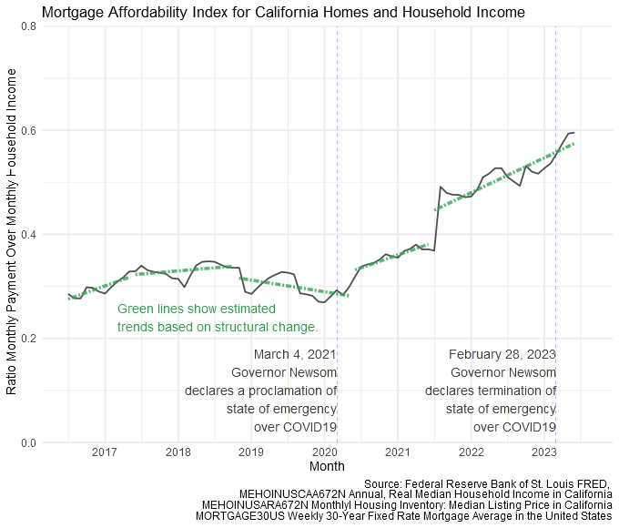

# Mortgage Affordability Index
Mortgage Affordability ratio based on mortgage payment as a share of HH income for California

<!-- badges: start -->
<!-- badges: end -->

The objective of this analysis is to provide an examination of the shifts in mortgage payments as a share of household income in California, especially after the COVID-19 pandemic. As of mid-2023, there has been an increase in the share of median income that is used to pay for the median-priced home in California. This condition has created social stresses that may take up to several years to abate as prior to the pandemic the index was less than 0.5. 

To estimate this index, the principal payment estimate was calculated from the average 30-year mortgage interest rate in the United States and 80% of the median listing price of a home in California (assuming there is a 20% downpayment). Then the estimated principal was divided over the monthly household income to obtain the index value. 

The data source for this analysis is from the Federal Reserve Bank of St. Louis FRED, MEHOINUSCAA672N Annual, Real Median Household Income in California; MEHOINUSARA672N Monthly Housing Inventory: Median Listing Price in California; and MORTGAGE30US Weekly 30-Year Fixed Rate Mortgage Average in the United States. 

 
A Tableau visualization can be found here https://public.tableau.com/app/profile/m.ev1333/viz/MorgageAffordabilityIndexForCaliforniaHomes/Dashboard1#1.
